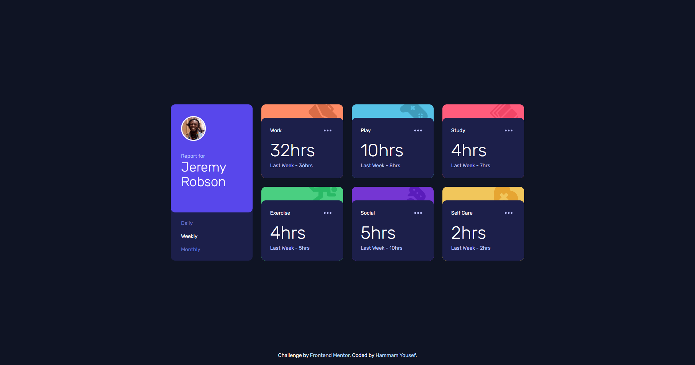

# Frontend Mentor - Time tracking dashboard solution

This is my solution to the [Time tracking dashboard challenge on Frontend Mentor](https://www.frontendmentor.io/challenges/time-tracking-dashboard-UIQ7167Jw). The challenge helped me practice building a responsive React dashboard with animated cards and dynamic data.

## Table of contents

- [Overview](#overview)
  - [The challenge](#the-challenge)
  - [Screenshot](#screenshot)
  - [Links](#links)
- [My process](#my-process)
  - [Built with](#built-with)
  - [What I learned](#what-i-learned)
  - [Continued development](#continued-development)
  - [Useful resources](#useful-resources)
- [Author](#author)

## Overview

### The challenge

Users should be able to:

- View the optimal layout for the site depending on their device's screen size
- See hover states for all interactive elements on the page
- Switch between viewing Daily, Weekly, and Monthly stats

### Screenshot



### Links

- Solution URL: https://www.frontendmentor.io/solutions/time-tracking-with-gsap-H04N4hTkor
- Live Site URL: https://time-tracking-dashboard-9fze.vercel.app/

## My process

### Built with

- Semantic HTML5 markup
- Tailwind CSS
- Flexbox & CSS Grid
- Mobile-first workflow
- [React](https://reactjs.org/) - JS library
- [GSAP](https://gsap.com/) - For card animations

### What I learned

- How to fetch and display dynamic JSON data in React.
- Using GSAP with React for smooth card entrance animations.
- Responsive layouts with Tailwind CSS and CSS Grid.
- Managing UI state for tabbed navigation (Daily/Weekly/Monthly).
- Accessibility improvements for interactive elements.

```jsx
// Example: Tab switching logic
const handleTabClick = (tab) => {
  if (tab !== activeTab) setActiveTab(tab);
};
```

### Continued development

- Improve accessibility (keyboard navigation, ARIA labels).
- Add user authentication and persistent data.
- Enhance animation and transitions for a smoother UX.

### Useful resources

- [GSAP React Docs](https://gsap.com/resources/react/)
- [Tailwind CSS Documentation](https://tailwindcss.com/docs)
- [Frontend Mentor Community](https://www.frontendmentor.io/community)

## Author

- Frontend Mentor - [@HammamYousef](https://www.frontendmentor.io/profile/HammamYousef)
- GitHub - [HammamYousef](https://github.com/HammamYousef)
